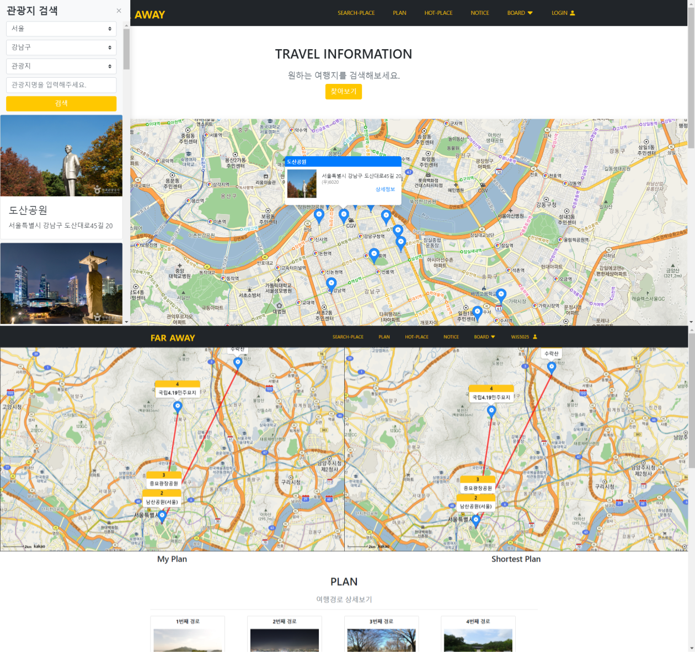
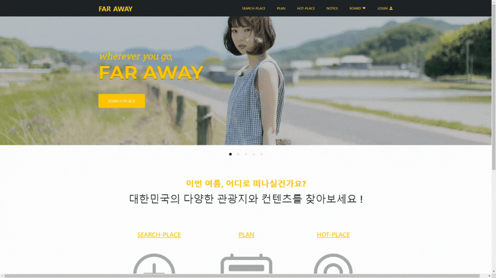
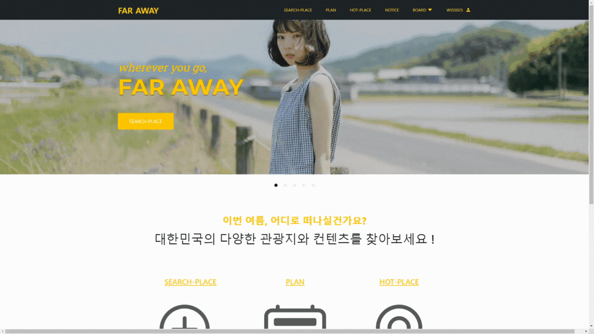

[🔗 (배포) 프로젝트 브라우저에서 열기](http://43.201.97.8)

### 📌 프로젝트 개요

- 한국관광공사가 제공하는 **대략 3만 건 이상의 관광 데이터**에 기초한 관광지 조회/추천 서비스.
- 사용자가 직접 나만의 여행 경로를 작성하고 공유하는 ‘plan’ 서비스 제공.
- 관광지로 등록되지 않은 명소를 공유할 수 있는 SNS 형태의 ‘hot-place’ 서비스 제공.

### 📌 프로젝트 기간 및 참여인원

- 프로젝트 기간 : 2023.05. ~ 2023.06. (4주)
- 참여 인원 : 3명
- (다른사람이 어떤업무를 담당했는지도 적으면, )

### 📌 사용 기술 및 개발 환경

| 주요 환경                                 | Windows 10, Visual Studio Code, IntelliJ |
| ----------------------------------------- | ---------------------------------------- |
| 사용 기술                                 | Vue2, Vuex, vue-bootstrap                |
| Spring Boot, Lombok, JPA, queryDSL, MySQL |
| 언어                                      | HTML5, CSS, JavaScript                   |
| Java                                      |
| 기타 협업 도구                            | Jira, GitHub, Notion, ERDcloud           |

### 📌 담당했던 업무

- UI 설계 및 디자인 전체
- 웹 프론트엔드 주요 기능 개발 (관광지 - 지도 / SNS 피드 / 회원 관리)
- 웹 프론트엔드 배포 (AWS EC2 / nginx 활용) ([바로가기](http://43.201.97.8))
- 웹 백엔드 ‘회원 관리’ 일부 개발 (CRUD, JWT 토큰 인증)

### 📌 **주요 기능 및 구현 과정**

- **CHAT GPT 연동 여행지 추천**

  - OpenAI API를 연동하여, CHAT GPT가 사용자가 입력한 키워드에 맞춰 여행지를 추천해줍니다.

  

- **메인페이지**

  - 기능 확장(광고 및 바로가기)을 고려한 캐러셀 형태의 배너 제공.

  

- **회원 관리**

  - 기본적인 회원가입/로그인/회원정보수정/회원탈퇴를 제공.
  - **JWT 인증** 방식(AT/RT)을 활용한 인증/인가 관리
  - Salt를 사용한 비밀번호 암호화/복호화.
  - 비회원 서비스와 회원 서비스를 구분하고, **Spring boot의 인터셉터를 활용**하여 로그인 여부에 따라 경로 이동을 제한.
  - 회원 등급 (관리자,일반회원)에 따른 기능 이용 제한.

  

- **공지사항 및 게시판**

  - ‘관리자’ 등급인 회원만 공지사항 게시글을 작성할 수 있음.
  - ‘일반’ 등급 회원은 자유게시판 및 Q&A 게시판에만 게시글을 작성할 수 있음.
  - 게시글에 원하는 자유형태의 파일을 첨부/다운로드할 수 있음.
  - 좋아요(공감) / 댓글
    - 대부분의 메뉴(공지사항, 게시판, 여행경로, 핫플레이스)에서 좋아요 및 댓글 기능 제공.
    - 모든 회원은 각 게시글에 대해 최대 한 번의 좋아요를 할 수 있음.
    - 댓글을 작성하여 게시글에 대한 의견을 남길 수 있음.

  

- **여행지 검색**

  - 시도/구군/여행지 형태/검색어 필터에 따라 원하는 관광지 목록을 얻을 수 있음.
  - 검색 결과는 사이드 바에서 카드 형태로, **카카오맵 지도**에서에 마커로 보여짐.
  - 다량의 검색 결과를 고려하여, 검색 결과를 페이징 처리

  

- **나만의 여행 계획(plan)**

  - 사용자가 내가 다녀온 여행 경로 혹은 추천하고 싶은 여행 경로를 게시글 형태로 작성.
  - 작성 시, 관광지 검색을 통해 원하는 여행지를 순차적으로 경로에 추가 및 삭제.
  - 작성 시, 추가 및 삭제한 여행지는 순서에 맞게 상단의 지도에 표시됨.
  - 조회 시, 사용자가 추천한 경로와 함께, DFS 알고리즘이 적용된 최단 경로를 상단 지도에 표기.

  

- **SNS 형태의 핫플레이스**

  - 관광지 목록에 없는 상세한 핫플레이스를 공유하기 위한 메뉴.
  - 뉴스 피드 형식으로 스크롤하면서 게시글을 조회하도록 설계/구현.
  - 무한스크롤을 제공하여, 별도의 페이지 이동 버튼 없이 추가적인 게시글 조회.
  - 피드 정렬 필터를 제공하여, 원하는 기준(최신순, 조회수순, 좋아요순)대로 선택하여 피드를 조회.

  

### 📌 성과 및 배운 점

- SSAFY 1학기 최종 프로젝트
- **프론트엔드**
  - Vuex를 활용한 전역 상태 관리, Vue-Router의 route 설정 등 vue와 연계되는 라이브러리 활용 방법 습득.
  - 유지보수를 고려하여, 특정한 기준에 맞게 컴포넌트를 설계하는 방법 습득.
    - 프로젝트 내 2회 이상 사용되면 컴포넌트화를 고려.
    - 그에 걸맞은 프로젝트 디렉토리 구조를 설계.
- **백엔드**
  - Spring의 MVC 패턴의 동작 과정 및 각 단의 역할을 이해.
  - Lombok, JPA와 같은 편리한 라이브러리 활용 방법 습득.
- 프론트엔드와 백엔드 두 역할에 모두 참여하면서, 각 역할의 입장에서 어떤 것을 필요로 하고 어떤 것을 피해야 할지 몸소 깨달을 수 있었음
  - response, 상태 코드 및 url 설계 등

### 📌 참고 링크

- **시연 영상**
  - https://youtu.be/utox9tFPI7g
- **프로젝트 GitHub Repository (Client)**
  - https://github.com/SSAFY-FarAway/faraway-client/tree/dev
- **프로젝트 GitHub Repository (Server)**
  - https://github.com/SSAFY-FarAway/faraway-server/tree/dev
